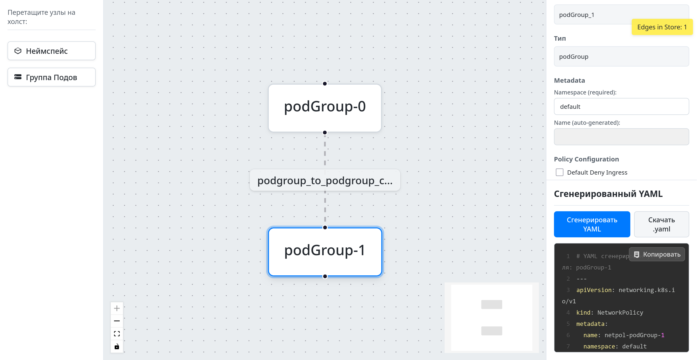

# K8s Network Policy Visual Editor

Визуальный редактор для интуитивно понятного создания и управления сетевыми политиками Kubernetes (NetworkPolicies). Приложение позволяет пользователям графически проектировать правила взаимодействия между группами подов и неймспейсами, а затем генерировать соответствующий YAML манифест.



## Оглавление

- [Функционал](#функционал)
- [Технологический стек](#технологический-стек)
- [Начало работы](#начало-работы)
  - [Пререквизиты](#пререквизиты)
  - [Установка и запуск](#установка-и-запуск)
- [Тестирование](#тестирование)
  - [E2E Тесты](#e2e-тесты)
  - [Unit/Integration Тесты](#unitintegration-тесты)
- [Сборка проекта](#сборка-проекта)
- [Ключевые сценарии](#ключевые-сценарии)
- [Структура проекта (кратко)](#структура-проекта-кратко)
- [Автор](#автор)
- [Лицензия](#лицензия)

## Функционал

*   **Визуальное создание элементов:**
    *   Перетаскивание узлов "Неймспейс" (`Namespace`) и "Группа Подов" (`PodGroup`) на холст.
    *   Создание связей (ребер) между узлами для определения правил Ingress и Egress.
*   **Редактирование свойств:**
    *   Настройка имени (лейбла) для Неймспейсов.
    *   Настройка Namespace и Labels (селекторов) для Групп Подов.
    *   Установка политик по умолчанию (`Default Deny Ingress`, `Default Deny Egress`) для Групп Подов.
*   **Конфигурация правил:**
    *   Добавление и редактирование портов и протоколов (TCP, UDP, SCTP, ICMP, ANY) для правил (ребер).
*   **Генерация YAML:**
    *   Автоматическая генерация валидного YAML манифеста Kubernetes `NetworkPolicy` на основе визуальной схемы.
*   **Валидация:**
    *   Встроенная валидация данных для узлов и правил с отображением ошибок и предупреждений.
*   **Интерактивный холст:**
    *   Поддержка масштабирования и панорамирования.
    *   Миникарта для удобной навигации.
*   **Управление элементами:**
    *   Выделение, перемещение и удаление узлов и ребер.

## Технологический стек

*   **Frontend:** React, TypeScript
*   **Сборка:** Vite
*   **Управление состоянием:** Zustand
*   **Визуализация графов:** ReactFlow
*   **Стилизация:** CSS Modules, CSS переменные
*   **E2E Тестирование:** Playwright
*   **Unit/Integration Тестирование:** Jest, React Testing Library
*   **Линтинг:** ESLint
*   **Работа с YAML:** js-yaml
*   **Вспомогательные библиотеки:** Lodash, uuid

## Начало работы

### Пререквизиты

*   Node.js (рекомендуется LTS версия, например, v18.x, v20.x)
*   npm (обычно идет с Node.js) или yarn

### Установка и запуск

1.  **Клонируйте репозиторий:**
    ```bash
    git clone https://github.com/mikhailde/k8s-netpol-editor.git
    cd k8s-netpol-editor/
    ```

2.  **Установите зависимости:**
    С использованием npm:
    ```bash
    npm install
    ```
    Или с использованием yarn:
    ```bash
    yarn install
    ```

3.  **Запустите dev-сервер:**
    С использованием npm:
    ```bash
    npm run dev
    ```
    Или с использованием yarn:
    ```bash
    yarn dev
    ```

4.  Откройте приложение в браузере по адресу (обычно): `http://localhost:5173`

## Тестирование

### E2E Тесты

Для запуска End-to-End тестов используется Playwright.

1.  Убедитесь, что dev-сервер приложения запущен (`npm run dev`).
2.  Выполните команду:
    ```bash
    npx playwright test
    ```
    Для запуска в headed-режиме (с отображением браузера):
    ```bash
    npx playwright test --headed
    ```
    Для запуска конкретного файла:
    ```bash
    npx playwright test e2e/имя-файла.spec.ts
    ```

### Unit/Integration Тесты

Для запуска unit и integration тестов используется Jest и React Testing Library.
```bash
npm test
```
Или для режима watch:
```bash
npm run test:watch
```
Для просмотра покрытия тестами:
```bash
npm run test:coverage
```

## Сборка проекта

Для создания production-сборки выполните:
```bash
npm run build
```
Или с использованием yarn:
```bash
yarn build
```
Собранные файлы будут находиться в директории `dist/`.

## Ключевые сценарии

Приложение реализует и позволяет протестировать следующие ключевые пользовательские сценарии:

1.  Создать политику "default deny" (Ingress + Egress) для группы подов `app=backend` в неймспейсе `default`.
2.  Разрешить Ingress к группе подов `app=backend` от группы подов `app=frontend` по порту `8080/TCP` в неймспейсе `default`.
3.  Разрешить Egress от группы подов `app=worker` в неймспейсе `processing` ко всем подам в неймспейсе `database` по порту `5432/TCP`.
4.  Разрешить Egress от группы подов `app=app1` в неймспейсе `app-ns` к группе подов `k8s-app=kube-dns` в неймспейсе `kube-system` по портам `53/UDP` и `53/TCP`.

E2E тесты покрывают сценарии 1 и 2. Остальные сценарии проверяются ручным тестированием.

## Структура проекта (кратко)

*   `public/`: Статические ассеты.
*   `src/`: Исходный код приложения.
    *   `App.tsx`: Корневой компонент приложения.
    *   `main.tsx`: Точка входа приложения.
    *   `features/`: Основные модули-фичи (Canvas, Inspector, Palette, OutputView и т.д.).
    *   `layout/`: Компонент основного лейаута.
    *   `services/`: Сервисы (например, YamlGenerationService, ValidationService).
    *   `store/`: Логика управления состоянием (Zustand).
    *   `types/`: Определения TypeScript типов.
    *   `utils/`: Вспомогательные утилиты.
*   `e2e/`: End-to-End тесты (Playwright).
*   `playwright.config.ts`: Конфигурация Playwright.
*   `vite.config.ts`: Конфигурация Vite.
*   `package.json`: Зависимости и скрипты проекта.
*   `.eslintrc.cjs`: Конфигурация ESLint.
*   `README.md`: Этот файл.

## Автор

*   mikhailde - (https://github.com/mikhailde)

## Лицензия

Этот проект распространяется под лицензией MIT. См. файл `LICENSE` для подробностей.
