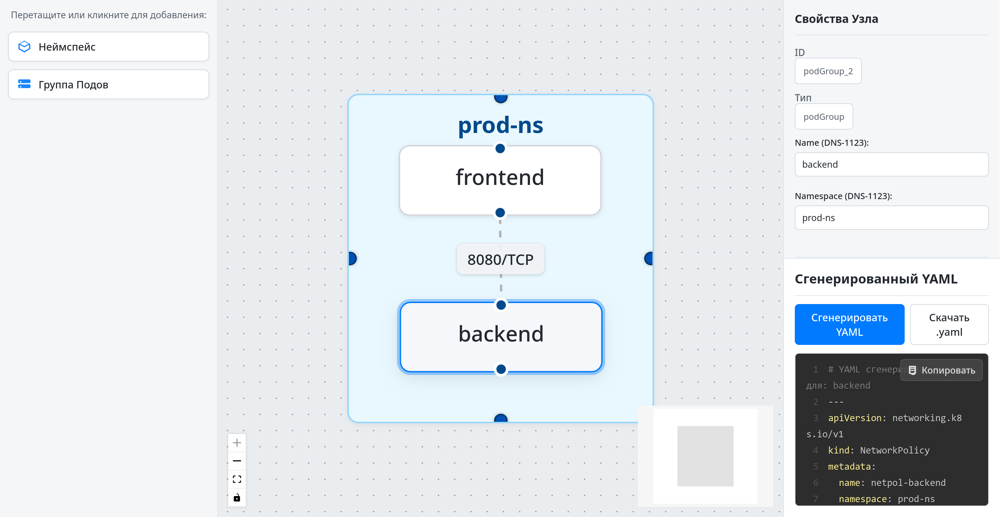

# K8s Network Policy Visual Editor

[](https://github.com/mikhailde/k8s-netpol-editor/actions/workflows/lint-test.yml)
[](https://opensource.org/licenses/MIT)
[](package.json)

Визуальный редактор для интуитивно понятного создания, редактирования и управления сетевыми политиками Kubernetes (NetworkPolicies). Приложение позволяет пользователям графически проектировать правила взаимодействия между группами подов и неймспейсами, а затем генерировать соответствующий YAML манифест с учетом валидации.


*Актуальный скриншот приложения, демонстрирующий интерфейс.*

## Оглавление

- [Зачем этот проект?](#зачем-этот-проект)
- [Ключевые возможности](#ключевые-возможности)
- [Технологический стек](#технологический-стек)
- [Начало работы](#начало-работы)
  - [Пререквизиты](#пререквизиты)
  - [Установка и запуск](#установка-и-запуск)
- [Как использовать](#как-использовать)
  - [Палитра элементов](#палитра-элементов)
  - [Холст](#холст)
  - [Инспектор свойств](#инспектор-свойств)
  - [Генерация YAML](#генерация-yaml)
- [Примеры сценариев](#примеры-сценариев)
- [Тестирование](#тестирование)
  - [E2E Тесты](#e2e-тесты)
  - [Unit/Integration Тесты](#unitintegration-тесты)
- [Сборка проекта](#сборка-проекта)
- [Структура проекта](#структура-проекта)
- [Автор](#автор)
- [Лицензия](#лицензия)

## Зачем этот проект?

Сетевые политики Kubernetes являются мощным инструментом для обеспечения безопасности в кластере, но их создание и отладка в формате YAML может быть сложной и подверженной ошибкам задачей, особенно для больших и сложных конфигураций.

**K8s Network Policy Visual Editor** стремится упростить этот процесс, предоставляя:
*   **Наглядность:** Визуальное представление связей и правил помогает лучше понять структуру сетевых взаимодействий.
*   **Интуитивность:** Графический интерфейс с перетаскиванием и редактированием свойств упрощает создание политик даже для пользователей, менее знакомых с YAML-синтаксисом NetworkPolicy.
*   **Скорость:** Быстрое прототипирование и изменение политик.
*   **Уменьшение ошибок:** Встроенная валидация и структурированный ввод данных помогают избежать распространенных ошибок конфигурации.

## Ключевые возможности

*   **Визуальное конструирование:**
    *   **Перетаскивание (Drag & Drop):** Легкое добавление узлов "Неймспейс" (`Namespace`) и "Группа Подов" (`PodGroup`) из палитры на интерактивный холст.
    *   **Создание связей:** Интуитивное определение правил Ingress и Egress путем соединения узлов на холсте. Ребра представляют собой правила, разрешающие трафик.
*   **Детальная настройка элементов:**
    *   **Инспектор свойств:** Контекстно-зависимая панель для редактирования всех атрибутов выбранного элемента (узла или ребра).
    *   **Неймспейсы:** Задание имени (лейбла). Автоматическое изменение размера для вмещения дочерних Групп Подов.
    *   **Группы Подов:** Настройка имени, целевого неймспейса, и набора лейблов (селекторов `podSelector`).
    *   **Политики по умолчанию:** Установка `Default Deny Ingress` и `Default Deny Egress` для Групп Подов.
*   **Конфигурация правил (ребер):**
    *   **Порты и протоколы:** Добавление и редактирование портов (числовых или именованных) и протоколов (TCP, UDP, SCTP, ICMP, ANY) для каждого правила.
*   **Генерация YAML:**
    *   **Автоматическая генерация:** Мгновенное создание валидного YAML манифеста Kubernetes `NetworkPolicy` на основе визуальной схемы для выбранной Группы Подов.
    *   **Предпросмотр с подсветкой:** Удобный просмотр сгенерированного YAML с подсветкой синтаксиса.
    *   **Копирование и скачивание:** Функции для копирования YAML в буфер обмена и скачивания в виде `.yaml` файла.
*   **Валидация "на лету":**
    *   **Обратная связь в UI:** Отображение ошибок и предупреждений непосредственно в инспекторе свойств и на узлах/ребрах, помогая исправлять проблемы до генерации YAML.
    *   **Проверка совместимости:** Валидация имен, лейблов, портов согласно стандартам Kubernetes.
*   **Интерактивный холст:**
    *   **Масштабирование и панорамирование:** Удобная навигация по большим схемам.
    *   **Миникарта:** Быстрый обзор и перемещение по холсту.
    *   **Управление элементами:** Выделение, перемещение (включая Группы Подов между Неймспейсами) и удаление узлов и ребер (клавиша `Delete` или `Backspace`).
*   **Современный и отзывчивый UI:**
    *   Чистый, интуитивно понятный дизайн, разработанный для удобства использования.
    *   Компоненты, использующие CSS Modules для инкапсуляции стилей и CSS переменные для гибкой настройки темы.

## Технологический стек

*   **Frontend:** React (v19), TypeScript
*   **Сборка и разработка:** Vite
*   **Управление состоянием:** Zustand
*   **Визуализация графов и холст:** ReactFlow
*   **Стилизация:** CSS Modules, CSS переменные (глобальные и компонентные)
*   **Генерация и работа с YAML:** `js-yaml`
*   **Подсветка синтаксиса YAML:** `react-syntax-highlighter`
*   **Тестирование:**
    *   E2E: Playwright
    *   Unit/Integration: Jest, React Testing Library
*   **Линтинг и форматирование:** ESLint (с конфигурацией для TypeScript и React)
*   **Вспомогательные утилиты:** Lodash, uuid

## Начало работы

### Пререквизиты

*   Node.js (рекомендуется последняя LTS версия, например, v18.x, v20.x)
*   npm (обычно поставляется с Node.js) или yarn

### Установка и запуск

1.  **Клонируйте репозиторий:**
    ```bash
    git clone https://github.com/mikhailde/k8s-netpol-editor.git
    cd k8s-netpol-editor
    ```

2.  **Установите зависимости:**
    Используя npm:
    ```bash
    npm install
    ```
    Или используя yarn:
    ```bash
    yarn install
    ```

3.  **Запустите сервер для разработки:**
    Используя npm:
    ```bash
    npm run dev
    ```
    Или используя yarn:
    ```bash
    yarn dev
    ```

4.  Откройте приложение в браузере по адресу, указанному в консоли (обычно `http://localhost:5173`).

## Как использовать

Интерфейс приложения разделен на три основные части:

### 1. Палитра элементов (слева)

Содержит доступные для добавления на холст типы узлов:
*   **Неймспейс:** Представляет собой пространство имен Kubernetes. Группы Подов могут быть размещены внутри Неймспейса.
*   **Группа Подов:** Представляет собой набор подов, объединенных общими лейблами, для которых будет создаваться NetworkPolicy.

Чтобы добавить элемент, перетащите его из палитры на холст или кликните по нему.

### 2. Холст (в центре)

Основное рабочее пространство, где вы визуально конструируете вашу сетевую политику.
*   **Добавляйте и размещайте** Неймспейсы и Группы Подов.
*   **Вкладывайте** Группы Подов в Неймспейсы, перетаскивая их. Неймспейс автоматически изменит размер.
*   **Создавайте правила (ребра):** Кликните на хэндл (маленький кружок) на исходном узле и, удерживая кнопку мыши, перетащите к хэндлу на целевом узле.
    *   Связь от Пода A к Поду B означает разрешение трафика от A к B (Ingress для B, Egress для A).
    *   Связь от Неймспейса X к Поду B означает разрешение Ingress к B от всех подов в Неймспейсе X.
    *   Связь от Пода A к Неймспейсу Y означает разрешение Egress от A ко всем подам в Неймспейсе Y.
*   **Управляйте холстом:** Используйте кнопки управления (масштаб, панорамирование, авто-расположение) или жесты мыши/тачпада. Миникарта в правом нижнем углу холста помогает с навигацией.
*   **Выделяйте элементы:** Кликните на узел или ребро, чтобы выделить его. Свойства выбранного элемента отобразятся в Инспекторе.
*   **Удаляйте элементы:** Выделите элемент и нажмите клавишу `Delete` или `Backspace`.

### 3. Правая панель

Содержит две вкладки или секции (может зависеть от текущего состояния):

#### Инспектор свойств

Отображает свойства выбранного на холсте элемента (узла или ребра) и позволяет их редактировать.
*   **Для Неймспейса:** Изменение имени (Label).
*   **Для Группы Подов:**
    *   Изменение имени (влияет на `metadata.name` политики).
    *   Указание неймспейса, к которому принадлежит группа подов.
    *   Редактирование лейблов (селекторов пода).
    *   Включение/выключение политик "Default Deny Ingress" и "Default Deny Egress".
*   **Для Ребра (Правила):**
    *   Добавление, редактирование и удаление портов и протоколов (TCP, UDP, SCTP, ICMP, ANY).
    *   Отображение информации о том, какое правило применяется (например, Ingress от Пода X к Поду Y).

При редактировании свойств, валидация происходит "на лету", и возможные ошибки или предупреждения отображаются рядом с соответствующими полями или в специальной панели проблем.

#### Генерация YAML

Эта секция позволяет сгенерировать YAML-манифест `NetworkPolicy` для **выбранной Группы Подов**.
1.  **Выберите Группу Подов** на холсте.
2.  Нажмите кнопку **"Сгенерировать YAML"**.
    *   Если есть критические ошибки валидации, связанные с выбранной Группой Подов или ее правилами, кнопка может называться **"Проверьте ошибки"**, и генерация YAML будет невозможна до их исправления.
3.  Сгенерированный YAML отобразится в текстовом поле с подсветкой синтаксиса.
    *   Если при генерации были учтены предупреждения (некритические проблемы), они будут отображены в виде комментариев (`# ПРЕДУПРЕЖДЕНИЕ: ...`) в начале YAML.
4.  Используйте кнопки **"Копировать"** и **"Скачать .yaml"** для работы с результатом.

## Примеры сценариев

Вот несколько типичных задач, которые можно выполнить с помощью редактора:

1.  **Создать политику "default deny" для `app=backend` в неймспейсе `default`:**
    1.  Добавьте узел "Неймспейс" на холст, назовите его `default`.
    2.  Добавьте узел "Группа Подов" внутрь неймспейса `default`.
    3.  Выделите эту Группу Подов. В Инспекторе:
        *   Задайте имя, например, `backend-app`.
        *   Укажите неймспейс `default`.
        *   Добавьте лейбл `app: backend`.
        *   Активируйте чекбоксы "Default Deny Ingress" и "Default Deny Egress".
    4.  Нажмите "Сгенерировать YAML".

2.  **Разрешить Ingress к `app=backend` от `app=frontend` по порту `8080/TCP` (оба в `default`):**
    1.  Убедитесь, что у вас есть две Группы Подов в неймспейсе `default`: одна с лейблом `app=frontend`, другая с `app=backend`.
    2.  Создайте связь (ребро) от узла `app=frontend` к узлу `app=backend`.
    3.  Выделите созданное ребро. В Инспекторе:
        *   Добавьте порт: `8080`, протокол: `TCP`.
    4.  Выделите Группу Подов `app=backend` и нажмите "Сгенерировать YAML".

3.  **Разрешить Egress от `app=worker` (неймспейс `processing`) ко всем подам в неймспейсе `database` по порту `5432/TCP`:**
    1.  Создайте Неймспейс `processing` и Неймспейс `database`.
    2.  В `processing` создайте Группу Подов `app=worker`.
    3.  Создайте связь от Группы Подов `app=worker` к Неймспейсу `database`.
    4.  Выделите ребро. В Инспекторе добавьте порт `5432`, протокол `TCP`.
    5.  Выделите Группу Подов `app=worker` и сгенерируйте YAML.

## Тестирование

Проект включает End-to-End и Unit/Integration тесты для обеспечения качества и стабильности.

### E2E Тесты

Используется Playwright для тестирования ключевых пользовательских сценариев.
1.  Убедитесь, что сервер разработки запущен (`npm run dev`).
2.  Для запуска всех E2E тестов:
    ```bash
    npx playwright test
    ```
3.  Для запуска в режиме с отображением браузера (headed):
    ```bash
    npx playwright test --headed
    ```
4.  Для запуска конкретного файла тестов:
    ```bash
    npx playwright test e2e/имя-файла.spec.ts
    ```

### Unit/Integration Тесты

Используется Jest и React Testing Library.
1.  Для однократного запуска всех тестов:
    ```bash
    npm test
    ```
2.  Для запуска в режиме отслеживания изменений (watch mode):
    ```bash
    npm run test:watch
    ```
3.  Для генерации отчета о покрытии тестами:
    ```bash
    npm run test:coverage
    ```
    Отчет будет доступен в директории `coverage/lcov-report/index.html`.

## Сборка проекта

Для создания production-сборки приложения выполните:
```bash
npm run build
```
Или с использованием yarn:
```bash
yarn build
```
Собранные статические файлы будут находиться в директории `dist/`.

## Структура проекта

*   `public/`: Статические ассеты, доступные напрямую.
*   `src/`: Исходный код приложения.
    *   `App.tsx`: Корневой React компонент.
    *   `main.tsx`: Точка входа приложения, рендеринг `App`.
    *   `layout/`: Компоненты, отвечающие за общую структуру страниц (например, `Layout.tsx`).
    *   `features/`: Основные функциональные модули (фичи) приложения. Каждый модуль обычно содержит свои компоненты, стили, и возможно, тесты.
        *   `Canvas/`: Логика и компоненты, связанные с холстом ReactFlow.
        *   `Inspector/`: Компоненты для панели свойств выбранного элемента.
        *   `Palette/`: Компоненты для палитры доступных узлов.
        *   `OutputView/`: Компоненты для отображения и управления сгенерированным YAML.
        *   `Nodes/`: Кастомные компоненты узлов для ReactFlow (Namespace, PodGroup).
        *   `Edges/`: Кастомные компоненты ребер для ReactFlow.
    *   `services/`: Сервисные классы для бизнес-логики (например, `YamlGenerationService.ts`, `ValidationService.ts`).
    *   `store/`: Логика управления состоянием приложения (Zustand store).
    *   `types/`: Определения TypeScript типов и интерфейсов, используемых в проекте.
    *   `constants.ts`: Глобальные константы приложения.
    *   `utils/`: Вспомогательные функции и утилиты.
    *   `App.css`: Глобальные стили и CSS переменные.
*   `e2e/`: End-to-End тесты (Playwright).
*   `docs/`: Документация и сопутствующие материалы (например, изображения).
*   `playwright.config.ts`: Конфигурация Playwright.
*   `vite.config.ts`: Конфигурация Vite.
*   `jest.config.js`, `jest.setup.ts`: Конфигурация Jest.
*   `eslint.config.js`: Конфигурация ESLint.
*   `package.json`: Метаданные проекта, зависимости и скрипты.
*   `README.md`: Этот файл.

## Автор

*   **mikhailde** - [GitHub Профиль](https://github.com/mikhailde)

## Лицензия

Этот проект распространяется под лицензией MIT. Подробности смотрите в файле `LICENSE`.